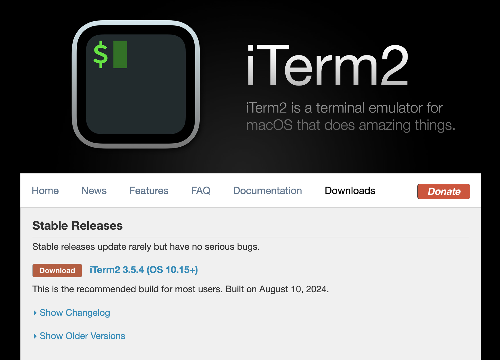

# macOS 개발 환경 설정

## 1. iTerm2 터미널 앱 설치

* macOS의 기본 터미널 대신 다양한 기능을 제공하는 iTerm2 터미널을 사용한다.

### 설치하기

* [iTerm 홈페이지](https://iterm2.com/) Downloads 탭에서 Stable Releases 애플리케이션을 다운로드하고 설치한다.

<figure><figcaption></figcaption></figure>

### 세팅하기

#### Color Preset 변경

* [iTerm Themes](https://iterm2colorschemes.com/) 홈페이지에서 마음에 드는 테마를 선택해 다운로드 한다.

<figure><figcaption></figcaption></figure>

* 다운로드 받은 파일 (.itermcolors)을 더블 클릭해 iTerm2 Color Preset에 추가한다.

<figure><figcaption></figcaption></figure>

* iTerm2를 실행한 후 설정 > Profiles 탭 > Colors의 오른쪽 하단의 Colors Presets...를 클릭해 추가한 프리셋으로 변경한다.

<figure><figcaption></figcaption></figure>

 

<figure><figcaption></figcaption></figure>

#### Profile 설정

## 2. 패키지 관리자 설치 (Homebrew)

## 3. 쉘 프롬프트 oh-my-zsh 설정


